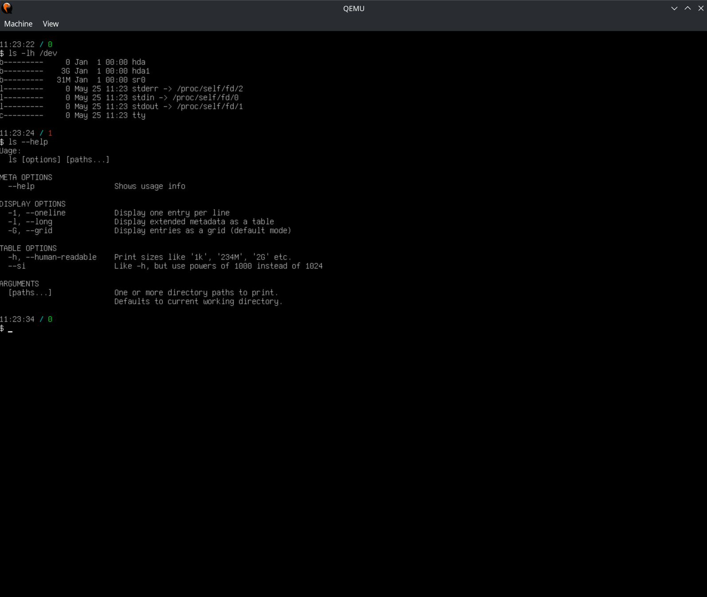

# StOS

Operating system kernel, working on x86 architecture.

_Kernel running shell program, in Qemu emulator_


## Included dependencies

- in the `dep/zap` directory: the set of two fonts from
  [ZAP Group Australia](https://www.zap.org.au/projects/console-fonts-zap/). It
  is released under [GNU GPL](./dep/zap/LICENSE) license.

## Syscalls

Syscalls are implemented with interrupt `int 0x80`, that accept 4 arguments in
registries (EAX, ECX, EDX, EBX), with first argument treated as a syscall ID.
They return a value in EAX as well.

The libc library contains wrappers for all implemented syscalls.

| Syscall name | ID | libc file | libc function | Description |
|---|---|---|---|---|
| _process management (`0x0n`)_ |   |   |   |   |
| `EXIT` | `0x00` | [`<stdlib.h>`](libc/include/stdlib.h) | `void exit(int status)` | Causes task termination, with given status code |
| `YIELD` | `0x01` | [`<sched.h>`](libc/include/sched.h) | `int sched_yield()` | Yield the processor, moving current task to the end of the queue |
| `GETPID` | `0x02` | [`<unistd.h>`](libc/include/unistd.h) | `pid_t getpid()` | Returns the process ID of the current process |
| `GETPPID` | `0x03` | [`<unistd.h>`](libc/include/unistd.h) | `pid_t getppid()` | Returns the process ID of the parent of the current process |
| `FORK` | `0x04` | [`<unistd.h>`](libc/include/unistd.h) | `int fork()` | Creates a fork of a current process |
| `WAIT` | `0x05` | [`<sys/wait.h>`](libc/include/sys/wait.h) | `int waitpid(int pid, int* status_code, int options)` | Waits for a selected child process to exit |
| `EXEC` | `0x06` | [`<unistd.h>`](libc/include/unistd.h) | `int execve(const char* path, const char* argv[], const char* envp[])` | Replace the current process with ELF executable |
| `GETCWD` | `0x07` | [`<unistd.h>`](libc/include/unistd.h) | `char* getcwd(char buf[], size_t size)` | Returns current working directory |
| `CHDIR` | `0x08` | [`<unistd.h>`](libc/include/unistd.h) | `int chdir(const char* path)` | Changes current working directory |
| `SLEEP` | `0x09` | [`<time.h>`](libc/include/time.h) | `int nanosleep(const struct timespec* duration, struct timespec* rem)` | Suspends current thread for some specified time |
| _file management (`0x1n`)_ |   |   |   |   |
| `OPEN` | `0x10` | [`<fcntl.h>`](libc/include/fcntl.h) | `int open(const char* path, int flags)` | Opens a file descriptor |
| `CLOSE`| `0x11` | [`<fcntl.h>`](libc/include/fcntl.h) | `int close(int fd)` | Closes the file descriptor |
| `WRITE` | `0x12` | [`<unistd.h>`](libc/include/unistd.h) | `int write(int fd, const void* buffer, size_t count)` | Writes up to _count_ bytes from _buffer_ to file descriptor _fd_ |
| `READ` | `0x13` | [`<unistd.h>`](libc/include/unistd.h) | `int read(int fd, void* buf, size_t count)` | Reads up to _count_ bytes from file descriptor _fd_ to _buffer_ |
| `IOCTL` | `0x14` | [`<sys/ioctl.h>`](libc/include/sys/ioctl.h) | `int ioctl(int fd, int op, void* arg)` | Manipulates underlying device params of special files |
| `LSEEK` | `0x15` | [`<unistd.h>`](libc/include/unistd.h) | `int lseek(int fd, int offset, int whence)` | Moves offset of the file descriptor _fd_ |
| `STAT` | `0x16` | [`<sys/stat.h>`](libc/include/sys/stat.h) | `int stat(const char* restrict path, struct stat* restrict statbuf)` | Loads statistics about given file _path_ |
| `FSTAT` | `0x17` | [`<sys/stat.h>`](libc/include/sys/stat.h) | `int fstat(int fd, struct stat* statbuf)` | Loads statistics about given file descriptor _fd_ |
| `READLINK` | `0x18` | [`<unistd.h>`](libc/include/unistd.h) | `size_t readlink(const char* restrict path, char* restrict buf, size_t bufsiz)` | Reads symlink path from `path` into `buf` |
| `GETDENTS` | `0x19` | _no wrapper_ | _no wrapper_ | Loads directory content |
| `DUP` | `0x1A` | [`<unistd.h>`](libc/include/unistd.h) | `int dup3(int oldfd, int newfd, int flags)` | Duplicates/changes file descriptor |
| _memory operations (`0x2n`)_ |   |   |   |   |
| `BRK` | `0x20` | [`<unistd.h>`](libc/include/unistd.h) | `void* brk(void* addr)` | Changes the location of current program break (end of heap address) |
| _time operations (`0x3n`)_ |   |   |   |   |
| `UNIXTIME` | `0x30` | [`<time.h>`](libc/include/time.h) | `time_t time(time_t* tloc)` | Returns current Unix timestamp |
| _inter-process commmunication (`0x4n`)_ |   |   |   |   |
| `SIGACT` | `0x40` | [`<signal.h>`](libc/include/signal.h) | `int sigaction(int signum, const struct sigaction* restrict act, struct sigaction* restrict oldact)` | Updates signal handlers |
| `SIGSEND` | `0x41` | [`<signal.h>`](libc/include/signal.h) | `int kill(pid_t pid, int sig)` | Sends signal to a process |
| `SIGRETURN` | `0x42` | _no wrapper_ | _no wrapper_ | For internal purposes |
| `PIPE` | `0x43` | [`<unistd.h>`](libc/include/unistd.h) | `int pipe2(int pipefd[2], int flags)` | Creates a pipe |

Syscalls without wrappers:

### GETDENTS

Accepts three arguments:
- `int fd` - file descriptor pointing to a directory
- `struct dirent* dir` - target where directory content will be written
- `int count` - max number of entries to be stored in `dir`

and returns:
- on success - a total number of read entries
- on failure - a negated value from `errno.h`

### SIGRETURN

Used automatically by the kernel at the end of signal handler trampoline, to
restore application state at the end of signal handler.

## Development

### Prerequisites

1. GCC Cross-Compiler - you can find installation instructions in the 
  ([OsDev Wiki](https://wiki.osdev.org/GCC_Cross-Compiler))
    - used commands for building are: `i686-elf-gcc`, `i686-elf-as`
2. Grub - for building bootable ISO files, without having to write a bootloader
    - used commands are: `grub-file`, `grub-mkrescue`
3. Qemu virtual machine - for launching the OS somewhere
    - used command is: `qemu-system-i386`
4. (optional) GCC compiler for host machine - for running unit tests

### Basic development tools

Running just `make all` should build a bootable `build/stos.iso` file.
Running `make qemu` will both create the bootable ISO file and immediately
launch the Qemu virtual machine with that ISO plugged into a CD-ROM.

To improve how CLang handles the code (errors, "Go to definition" for libraries)
you can install `bear` package and then run `bear -- make qemu`. It will create
a `compile_commands.json` file (which is added to `.gitignore`) containing
arguments for compiler that is respected by CLang.

All text printed to VGA text mode is by default sent to COM1 port, which Qemu
then prints to the command line.

### Hard drive image

Hard drive image is stored in `.qemu/disk.img`. You can mount it by running:

```shell
sudo losetup --find --show --partscan .qemu/disk.img
```

As an output, it will print you a newly created device file, for example
`dev/loop0`. It will also create device files for partitions (`/dev/loop0p1`)
that can be mounted in a usual way:

```shell
mkdir .qemu/mounted
sudo mount /dev/loop0p1 .qemu/mounted
```

Remember that partition has to be created first (with tool like `parted`) and
initialized. For example, to initialize ext2 partition:

```shell
sudo mkfs.ext2 /dev/loop0p1
```

### Unit tests

Some parts of the code (mainly in libraries) have unit tests. They are all
compiled and executed on host machine with `make test`. Running it requires
`gcc` compiler on host.

### Source code structure
```
<root directory>
├── kernel/              # Main source directory 
│   ├── arch/            # Files specific to a specific infrastructure
│   │   └── i386/
│   ├── include/kernel/  # Common header files used by the kernel that are
│   │                    # implemented in the infra-specific code
│   ├── kernel/          # Main source code of the kernel
│   └── grub.cfg         # Bootloader configuration
├── libc/                # implementation of libc standard library
│   ├── include/         # libc headers
│   └── src/             # Implementations of libc headers
├── libds/               # Custom libds library of data structures
├── libtime/             # Custom libtime library for time utilities
├── usermode/            # Usermode programs built and loaded into initrd
└── dep/                 # Various external dependencies
```

### What's implemented

- Booting
- GDT, interrupts, IRQ
- Memory
  - Paging
  - Physical memory allocation (buddy allocator)
  - `kmalloc` and `kfree`
- PIT driver
- PS/2 driver
- PS/2 keyboard driver
- ATA driver
- Debugging CLI - running tests, displaying stats, shutdown, reboot
- Unit tests for libc
- memory leak test - check memory stats, then run all mem tests multiple times,
  then check memory stats again and compare if there are any changes
- Basic ACPI parsing - shutdown & reboot support
- Virtual File System (with initrd)
- Multitasking
- Usermode tasks
- Heap for usermode
- forking and `exec` processes
- Support for ISO9660 and ext2 filesystem formats

### (Short-term) todo list


- Support for more than 1 GiB of RAM
  - that's currently not working because we're trying to map all physical
    RAM in paging, which doesn't make sense above 1 GiB. We should implement
    demand paging instead.
- Long mode (64-bit)
